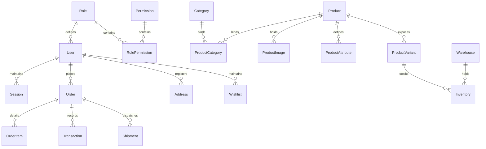

# Enterprise E-Commerce Backend Architecture

A high-performance, modular, and horizontally scalable e-commerce backend built with **Node.js 22**, **Fastify**, **Prisma ORM**, **PostgreSQL**, and **Redis**. Designed to serve millions of requests with optimal resource utilization.

---

## 🏗️ Architecture Design & Structure

The codebase is built on **SOLID principles** and follows the **Repository-Service-Controller (R-S-C)** design pattern, enforcing clean separation of concerns and database independence.

```
backend/
├── config/             # System configuration loaders and Zod validation schemas
├── database/           # Non-prisma raw database resources
├── prisma/             # Prisma schema, migrations, and database seeders
├── src/
│   ├── plugins/        # Fastify connection adapter plugins (Prisma, Redis, Storage)
│   ├── middlewares/    # Custom route hooks (JWT Authentication, RBAC, Rate limits)
│   ├── utils/          # Standard response decorators and Exception classes
│   ├── repositories/   # Data access isolation layer (Prisma calls only)
│   ├── services/       # Core business logic processing (transaction scopes, caches)
│   ├── controllers/    # Request parse models and API route coordinators
│   └── routes/         # Fastify route endpoints & Swagger OpenAPI schemas
├── tests/              # Vitest integration test suite
├── Dockerfile          # Production multi-stage docker compiler
├── docker-compose.yml  # Local multi-service infrastructure deployment
└── ecosystem.config.cjs# PM2 cluster orchestration configuration
```

### Flow of a Request
```
[Client Request] ──> [Fastify Route Engine] ──> [Auth/Rate-Limit Middlewares]
                           │
                           ▼
                  [Zod Controller Model Validation]
                           │
                           ▼
                  [Service Business Logic / Redis Caching]
                           │
                           ▼
                  [Repository / Prisma Query Layer] ──> [PostgreSQL Database]
```

---

## 🛠️ Technology Stack & Dependencies

* **Runtime**: Node.js 22 (ESM format)
* **Web Framework**: Fastify (Low overhead HTTP routing)
* **Database Access**: Prisma ORM with PostgreSQL
* **Caching & Rate-Limiting**: Redis (ioredis)
* **Security & Auth**: Bcrypt, JWT (rotation enabled), Helmet, CORS
* **Validation**: Zod (strict validation pipelines)
* **Storage & Processing**: AWS S3 Client / Local storage, Sharp (AVIF/WebP image processing)
* **Task Manager**: PM2 (clustering for multicore systems)
* **Tests**: Vitest

---

## 🔒 Security Architectures

1. **Brute Force Protection**: Detects repeatedly failed logins. Exceeding `5` attempts locks the account status for `15 minutes` in Redis/DB.
2. **Access & Refresh JWT Rotation**: On access token expiration, client calls `/refresh` passing the long-term refresh token. A new pair is generated, rotating the keys and invalidating the older session.
3. **Role & Permission Matrix (RBAC / PBAC)**:
   * **Super Admin**: Bypasses all permissions.
   * **Admin**: Store settings, taxes, categories, brands, inventory.
   * **Warehouse Manager**: Adjust stock levels, stock transfers.
   * **Marketing Manager**: CMS pages, coupons.
   * **Finance Manager**: Payments, refunds, reports.
   * **Customer**: Standard checkout, carts, profile, reviews.
   * **Vendor**: Standard products write catalog access.

---

## 📦 Database Entity Model (ERD Summary)

The schema utilizes **UUID Primary Keys**, composite indexing on lookups (variant SKU, search tags), foreign keys, and soft delete hooks (`deletedAt`).



---

## 🚀 Getting Started (Development Setup)

### Prerequisites
* Install [Node.js 22+](https://nodejs.org/)
* Install [Docker & Docker Compose](https://www.docker.com/)

### 1. Launch Docker Infrastructure
Spin up PostgreSQL, Redis, MinIO (Local S3), Mailhog, and pgAdmin services:
```bash
docker-compose up -d
```

### 2. Install Project Dependencies
```bash
npm install
```

### 3. Apply Prisma Migrations & Seed Database
Create tables, composite indexes, and seed demo taxonomy, users, warehouses, and product listings:
```bash
npx prisma migrate dev --name init
npm run seed
```

### 4. Boot Up Development Server
```bash
npm run dev
```
The API server will listen on `http://localhost:3000`.

---

## 📖 API Documentation & Swagger UI

Fastify automatically compiles route metadata and exposes interactive Swagger OpenAPI specs.
* **Swagger Documentation URL**: [http://localhost:3000/documentation](http://localhost:3000/documentation)

---

## 🧪 Testing

Vitest runs integration test loops against in-memory server mock instances:
```bash
npm run test
```

---

## 🚢 Production Deployment Guide

### PM2 Clustering
For deployment on multi-core VMs (EC2 / Bare Metal):
```bash
npm install pm2 -g
pm2 start ecosystem.config.cjs --env production
```
This spawns Fastify clustered nodes to maximize server core throughput.

### AWS Integration Settings
To run in cloud environments, configure the following `.env` parameters:
* `STORAGE_DRIVER=S3`
* `AWS_S3_BUCKET=your-production-bucket`
* Remove `AWS_S3_ENDPOINT` to direct file uploads straight to AWS S3.
* Setup AWS RDS PostgreSQL endpoint in `DATABASE_URL` and ElastiCache Redis endpoint in `REDIS_URL`.
